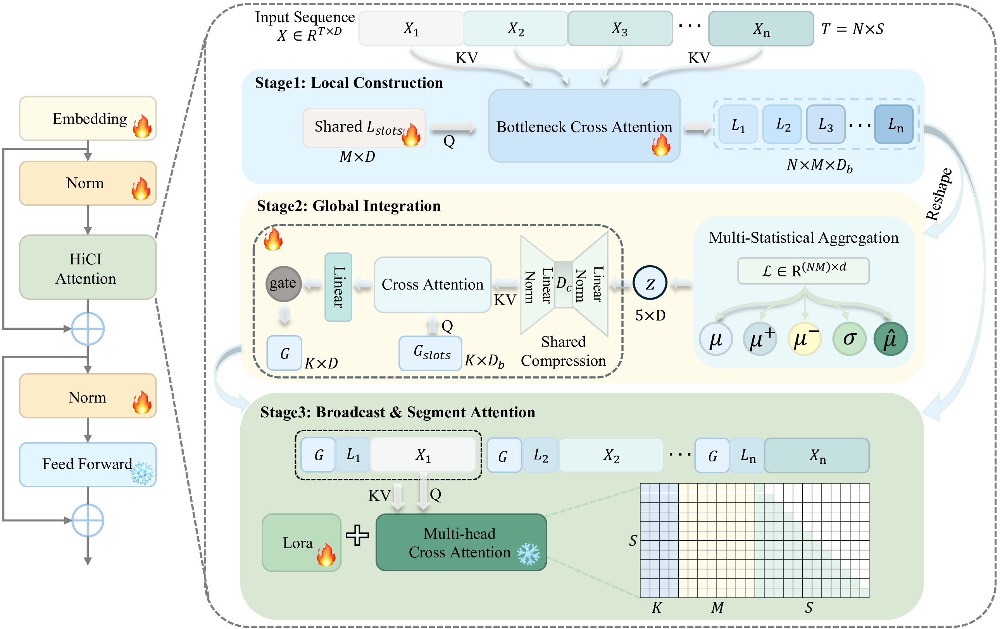

<h2 align="center">HiCI: Hierarchical Construction-Integration for Long-Context Attention</h2>

<p align="center">
  <a href="https://arxiv.org/abs/2603.20843"></a>
  <a href="https://huggingface.co/ZengXiangyu/models"></a>
  <a href="https://huggingface.co/ZengXiangyu/datasets"></a>
  <a href="LICENSE"></a>
  <a href="WEIGHT_LICENSE"></a>
</p>

<p align="center">

</p>

<p align="center">
  <a href="https://github.com/zengxyyu">Xiangyu Zeng</a>,
  Qi Xu,
  Yunke Wang,
  Chang Xu
</p>

---

## Table of Contents

- [News](#news)
- [Highlights](#highlights)
- [Requirements](#requirements)
- [Installation](#installation)
- [Data Preparation](#data-preparation)
- [Models](#models)
- [Training](#training)
- [Evaluation](#evaluation)
- [Citation](#citation)
- [Acknowledgement](#acknowledgement)
- [License](#license)

---

## News

- [2025.04] HiCI v2 updated on arXiv. Expanded results on LLaMA-3 and Qwen3.
- [2025.03] [HiCI paper](https://arxiv.org/abs/2603.20843) released on arXiv.

---

## Highlights

1. HiCI injects a three-stage hierarchical attention module (**Local Construction → Global Integration → Top-down Broadcast**) into each transformer layer as a plug-in. It is fully compatible with Flash-Attention and requires **no architectural changes at inference time**.
2. We release fine-tuned models across multiple scales and context lengths, including [Llama-2-7b-HiCI-100k](https://huggingface.co/ZengXiangyu/models), [Llama-2-13b-HiCI-64k](https://huggingface.co/ZengXiangyu/models), [Llama-3-8b-HiCI-32k](https://huggingface.co/ZengXiangyu/models), and [Qwen3-8b-HiCI-48k](https://huggingface.co/ZengXiangyu/models).
3. HiCI achieves consistent perplexity improvements over LongLoRA at equal context length and surpasses GPT-3.5-Turbo-16K on code comprehension — while adding only **~5.5%** additional parameters.

---

## Requirements

To download and use the pre-trained models you will need:

- A [Hugging Face](https://huggingface.co) account.
- For LLaMA-based models: accept the [Meta LLaMA license](https://huggingface.co/meta-llama/Llama-2-7b-hf).

---

## Installation

**Hardware:** Python 3.11, CUDA 12.4. Training requires multi-GPU (we use 8× H100 80GB for LLaMA models and 8× H200 for Qwen3).

**Step 1** — clone the repository:

```bash
git clone https://github.com/zengxyyu/HiCI.git && cd HiCI
```

**Step 2** — install dependencies:

```bash
# For LLaMA-2 / LLaMA-3
pip install -r requirements.txt

# For Qwen3 (requires transformers 4.51)
pip install -r requirements-qwen3.txt
```

**Step 3** — install Flash Attention (compiled from source):

```bash
pip install flash-attn==2.5.8 --no-build-isolation
```

> If DeepSpeed reports a CUDA version mismatch: `export DS_SKIP_CUDA_CHECK=1`

After installation, use either a [released model](#models) for inference or [fine-tune](#training) a model to fit your preferences.

---

## Data Preparation

### Pre-training data

```bash
python -c "
from datasets import load_dataset
dataset = load_dataset('ZengXiangyu/RedPajama-Data-1T-Sample', cache_dir='./cache')
dataset.save_to_disk('./cache/datasets')
"
```

### SFT data (LongAlpaca-12k)

```bash
mkdir -p data/sft
wget -P data/sft https://huggingface.co/datasets/Yukang/LongAlpaca-12k/resolve/main/LongAlpaca-12k.json
```

### Evaluation data (PG-19)

**Option 1 — Download pre-tokenized files (recommended):**

One-liner to download all files at once:

```bash
mkdir -p data/pg19_llama2 data/pg19_llama3 data/pg19_qwen3 && \
BASE="https://huggingface.co/datasets/ZengXiangyu/pg19/resolve/main" && \
wget -P data/pg19_llama2/ $BASE/pg19_llama2/test.bin \
     $BASE/pg19_llama2/validation.bin && \
wget -P data/pg19_llama3/ $BASE/pg19_llama3/test.bin && \
wget -P data/pg19_qwen3/  $BASE/pg19_qwen3/test.bin
```

Or individually:

```bash
wget -P data/pg19_llama2/ https://huggingface.co/datasets/ZengXiangyu/pg19/resolve/main/pg19_llama2/test.bin
wget -P data/pg19_llama2/ https://huggingface.co/datasets/ZengXiangyu/pg19/resolve/main/pg19_llama2/validation.bin
wget -P data/pg19_llama3/ https://huggingface.co/datasets/ZengXiangyu/pg19/resolve/main/pg19_llama3/test.bin
wget -P data/pg19_qwen3/  https://huggingface.co/datasets/ZengXiangyu/pg19/resolve/main/pg19_qwen3/test.bin
```

<details>
<summary>Option 2 — Prepare from scratch</summary>

First download the raw text (requires internet access):

```bash
python3 download_pg19.py --split test
# → data/pg19_raw/test.txt
```

Then tokenize for each model family:

```bash
# LLaMA-2
python3 -c "
import numpy as np, os
from transformers import AutoTokenizer
tokenizer = AutoTokenizer.from_pretrained('./models/Llama-2-7b-hf')
text = open('data/pg19_raw/test.txt').read()
tokens = tokenizer.encode(text)
os.makedirs('data/pg19_llama2', exist_ok=True)
np.array(tokens, dtype=np.uint16).tofile('data/pg19_llama2/test.bin')
print(f'Done: {len(tokens):,} tokens')
"

# LLaMA-3
python3 prepare_eval_data.py \
    --model_path ./models/Meta-Llama-3-8B \
    --text_file data/pg19_raw/test.txt \
    --output_dir data/pg19_llama3

# Qwen3
python3 prepare_eval_data.py \
    --model_path ./models/Qwen3-8B \
    --text_file data/pg19_raw/test.txt \
    --output_dir data/pg19_qwen3
```

</details>

---

## Models

> Models are currently private and will be released upon paper acceptance.
> Model page: [https://huggingface.co/ZengXiangyu/models](https://huggingface.co/ZengXiangyu/models)

| Model                | Base        | Context |                      Link                       |
| :------------------- | :---------- | :-----: | :---------------------------------------------: |
| Llama-2-7b-HiCI-8k   | LLaMA-2-7B  |   8K    | [🤗](https://huggingface.co/ZengXiangyu/models) |
| Llama-2-7b-HiCI-32k  | LLaMA-2-7B  |   32K   | [🤗](https://huggingface.co/ZengXiangyu/models) |
| Llama-2-7b-HiCI-100k | LLaMA-2-7B  |  100K   | [🤗](https://huggingface.co/ZengXiangyu/models) |
| Llama-2-13b-HiCI-64k | LLaMA-2-13B |   64K   | [🤗](https://huggingface.co/ZengXiangyu/models) |
| Llama-3-8b-HiCI-32k  | LLaMA-3-8B  |   32K   | [🤗](https://huggingface.co/ZengXiangyu/models) |
| Qwen3-8b-HiCI-48k    | Qwen3-8B    |   48K   | [🤗](https://huggingface.co/ZengXiangyu/models) |

<details>
<summary>Perplexity on PG-19 (↓ lower is better)</summary>

**LLaMA-2**

| Model            | Train ctx |  2K  |  4K  |  8K  | 16K  | 32K  |
| :--------------- | :-------: | :--: | :--: | :--: | :--: | :--: |
| LLaMA-2-7B-HiCI  |    8K     | 7.27 | 7.01 | 6.93 |  —   |  —   |
| LLaMA-2-7B-HiCI  |    16K    | 7.55 | 7.24 | 7.02 | 6.93 |  —   |
| LLaMA-2-7B-HiCI  |    32K    | 7.87 | 7.50 | 7.26 | 7.09 | 7.11 |
| LLaMA-2-13B-HiCI |    8K     | 6.68 | 6.46 | 6.34 |  —   |  —   |
| LLaMA-2-13B-HiCI |    16K    | 6.95 | 6.65 | 6.43 | 6.28 |  —   |

**LLaMA-3**

| Model           | Train ctx | Steps |  2K  |  4K  |  8K  | 16K  | 32K  |
| :-------------- | :-------: | :---: | :--: | :--: | :--: | :--: | :--: |
| LLaMA-3-8B      |    8K     |   —   | 9.19 | 8.71 | 8.38 | >100 | >100 |
| LLaMA-3-8B-HiCI |    32K    | 1000  | 7.90 | 7.86 | 7.54 | 7.28 | 7.20 |

**Qwen3**

| Model               | Train ctx | Steps |  2K   |  4K   |  8K   |  16K  |  32K  |  48K  |
| :------------------ | :-------: | :---: | :---: | :---: | :---: | :---: | :---: | :---: |
| Qwen3-8B (baseline) |    32K    |   —   | 13.26 | 12.58 | 12.08 | 11.72 | 12.76 | 12.01 |
| Qwen3-8B-HiCI       |    48K    |  500  | 11.48 | 10.85 | 10.33 | 9.97  | 10.98 | 10.23 |
| Qwen3-8B-HiCI       |    48K    | 1000  | 11.25 | 10.64 | 10.13 | 9.78  | 10.76 | 10.04 |

See the [paper](https://arxiv.org/abs/2603.20843) for full results including Proof-pile, LongBench, and topic retrieval.

</details>

---

## Training

### Download Base Models

> Login to Hugging Face first. For LLaMA models, also accept the Meta license on the model page before downloading.
> ```bash
> huggingface-cli login
> ```

```bash
# LLaMA-2-7B
huggingface-cli download meta-llama/Llama-2-7b-hf \
    --local-dir ./models/Llama-2-7b-hf \
    --local-dir-use-symlinks False \
    --max-workers 1

# LLaMA-2-13B
huggingface-cli download meta-llama/Llama-2-13b-hf \
    --local-dir ./models/Llama-2-13b-hf \
    --local-dir-use-symlinks False

# LLaMA-3-8B
huggingface-cli download meta-llama/Meta-Llama-3-8B \
    --local-dir ./models/Meta-Llama-3-8B \
    --local-dir-use-symlinks False

# Qwen3-8B
huggingface-cli download Qwen/Qwen3-8B \
    --local-dir ./models/Qwen3-8B \
    --local-dir-use-symlinks False \
    --max-workers 1
```

### Script–model pairing

| Use case                         | Shell script                    | Python script             | Attention module         |
| -------------------------------- | ------------------------------- | ------------------------- | ------------------------ |
| LLaMA-2/3 continued pre-training | `train_fine_tune_hici.sh`       | `fine-tune_hici.py`       | `llama_attn_hici.py`     |
| LLaMA-2/3 SFT                    | `train_fine_tune_hici_sft.sh`   | `fine-tune_hici_sft.py`   | `llama_attn_hici_sft.py` |
| Qwen3 continued pre-training     | `train_fine_tune_hici_qwen3.sh` | `fine-tune_hici_qwen3.py` | `qwen3_attn_hici.py`     |

### LLaMA-2 / LLaMA-3

```bash
bash train_fine_tune_hici.sh
```

Or manually (LLaMA-2-7B, 8K context example):

```bash
torchrun --nproc_per_node 8 --master_port=38493 fine-tune_hici.py \
    --model_name_or_path ./models/Llama-2-7b-hf \
    --bf16 True \
    --output_dir ./checkpoints/Llama-2-7b-8k-hici \
    --cache_dir ./cache \
    --model_max_length 8192 \
    --use_flash_attn True \
    --low_rank_training True \
    --num_train_epochs 1 \
    --per_device_train_batch_size 2 \
    --gradient_accumulation_steps 8 \
    --learning_rate 2e-5 \
    --warmup_steps 20 \
    --lr_scheduler_type constant_with_warmup \
    --logging_steps 1 \
    --deepspeed ds_configs/stage2.json \
    --tf32 True \
    --max_steps 1000 \
    --num_chunks 4 \
    --num_local_slots 8 \
    --global_slots 4 \
    --num_heads 8 \
    --use_bottleneck True \
    --bottleneck_dim 512 \
    --shared_compress_dim 128 \
    --use_local_constructor True \
    --use_global_integrator True \
    --use_hierarchical_forward True \
    --use_llama_init False \
    --use_local_constructor_flash False \
    --trainable_params "embed,norm,local_constructor,global_integrator" \
    --hici_lr 2e-4 \
    --hici_grad_clip 0.3
```

### Qwen3

```bash
bash train_fine_tune_hici_qwen3.sh
```

Or manually (Qwen3-8B, 48K context example):

```bash
torchrun --nproc_per_node 8 \
    --master_port=38493 \
    fine-tune_hici_qwen3.py \
    --model_name_or_path ./models/Qwen3-8B \
    --bf16 True \
    --output_dir ./checkpoints/Qwen3-8b-hici-48k \
    --cache_dir ./cache \
    --model_max_length 49152 \
    --use_flash_attn True \
    --low_rank_training True \
    --num_train_epochs 1 \
    --per_device_train_batch_size 2 \
    --gradient_accumulation_steps 8 \
    --learning_rate 2e-5 \
    --warmup_steps 20 \
    --lr_scheduler_type constant_with_warmup \
    --logging_steps 1 \
    --deepspeed ds_configs/stage3.json \
    --tf32 True \
    --max_steps 1000 \
    --save_steps 500 \
    --save_total_limit 2 \
    --num_chunks 4 \
    --num_local_slots 8 \
    --global_slots 4 \
    --num_heads 8 \
    --use_bottleneck True \
    --bottleneck_dim 512 \
    --shared_compress_dim 128 \
    --use_local_constructor True \
    --use_global_integrator True \
    --use_hierarchical_forward True \
    --use_attn_init False \
    --use_local_constructor_flash False \
    --trainable_params "embed,norm,local_constructor,global_integrator" \
    --hici_lr 2e-4 \
    --hici_grad_clip 0.3
```

If you have access to multiple nodes (e.g. two 4-GPU nodes), use the multi-node script instead. Run the following on each node simultaneously, passing the node rank (0 for master, 1, 2, … for workers):

```bash
bash train_fine_tune_hici_qwen3_multinode.sh 0   # master node
bash train_fine_tune_hici_qwen3_multinode.sh 1   # worker node
```

### Supervised Fine-Tuning

SFT resumes from a HiCI pre-trained checkpoint to teach instruction-following while preserving long-context capabilities.

```bash
bash train_fine_tune_hici_sft.sh
```

Or manually (LLaMA-2-7B, 16K context example):

```bash
torchrun --nproc_per_node 8 \
    --master_port=38493 \
    fine-tune_hici_sft.py \
    --model_name_or_path ./models/Llama-2-7b-hf \
    --resume_from_checkpoint ./checkpoints/Llama-2-7b-hici-16k/checkpoint-1000 \
    --data_path ./data/sft/LongAlpaca-12k.json \
    --bf16 True \
    --output_dir ./checkpoints/Llama-2-7b-hici-sft-16k \
    --cache_dir ./cache \
    --model_max_length 16384 \
    --use_flash_attn True \
    --low_rank_training True \
    --num_train_epochs 15 \
    --max_steps 3000 \
    --per_device_train_batch_size 1 \
    --per_device_eval_batch_size 2 \
    --gradient_accumulation_steps 8 \
    --learning_rate 2e-5 \
    --warmup_steps 20 \
    --lr_scheduler_type constant_with_warmup \
    --logging_steps 1 \
    --deepspeed ds_configs/stage2.json \
    --tf32 True \
    --save_steps 500 \
    --save_total_limit 4 \
    --num_chunks 4 \
    --num_local_slots 8 \
    --global_slots 4 \
    --num_heads 8 \
    --use_bottleneck True \
    --bottleneck_dim 512 \
    --shared_compress_dim 128 \
    --use_local_constructor True \
    --use_global_integrator True \
    --use_hierarchical_forward True \
    --use_llama_init False \
    --use_local_constructor_flash False \
    --trainable_params "embed,norm,local_constructor,global_integrator" \
    --hici_lr 2e-4 \
    --hici_grad_clip 0.3
```

`--resume_from_checkpoint` is optional; omit it to fine-tune directly from the base model.

### Key hyperparameters

| Argument                        | Default | Description                                                                                            |
| ------------------------------- | :-----: | ------------------------------------------------------------------------------------------------------ |
| `--num_local_slots`             |    8    | Learnable query slots per segment (local cardinality M)                                                |
| `--global_slots`                |    4    | Global context vectors (global cardinality K)                                                          |
| `--num_heads`                   |    8    | Attention heads in HiCI modules (use 40 for 13B)                                                       |
| `--bottleneck_dim`              |   512   | Bottleneck compression dimension                                                                       |
| `--shared_compress_dim`         |   128   | Shared compressor intermediate dim for `GlobalIntegratorShared` (128 for 7B/8B, 160 for 13B)           |
| `--num_chunks`                  |    4    | Number of segments to split the input into                                                             |
| `--hici_lr`                     |  2e-4   | Separate LR for HiCI modules (≈ 10× base LR)                                                           |
| `--hici_grad_clip`              |   0.3   | Gradient clipping for HiCI modules                                                                     |
| `--use_local_constructor_flash` |  False  | Use `LocalConstructorFlash` (flash-attn cross-attention); default `False` uses `LocalConstructorMulti` |

### Weight Extraction

After training, two steps are required before evaluation or merging.

**Step 1 — Reconstruct full weights from DeepSpeed ZeRO shards:**

```bash
cd ./checkpoints/Llama-3-8b-hici-32k/checkpoint-1000 && python zero_to_fp32.py . . && cd -
```

This produces `pytorch_model.bin` inside the checkpoint directory.

**Step 2 — Extract LoRA and HiCI parameters:**

```bash
python get_trainable_weights.py \
    --checkpoint_path ./checkpoints/Llama-3-8b-hici-32k/checkpoint-1000 \
    --trainable_params "embed,norm,local_constructor,global_integrator"
```

This produces `trainable_params.bin`, which is required by the eval and merge scripts.

> Skipping either step causes `trainable_params.bin not found` during evaluation or merging.

### Merging

Training produces a base model and a separate `trainable_params.bin` (LoRA + HiCI adapter weights). Merging combines them into a single self-contained HuggingFace model directory for easier distribution and loading. There are two options with different trade-offs:

- **Option A (LoRA adapters + embed/norm only)**: HiCI modules are discarded; the result is a standard transformer that works with any inference tool (vLLM, `transformers`, etc.) without any custom code.
- **Option B (LoRA adapters + embed/norm + HiCI modules)**: HiCI modules are included in the merged weights; loading still requires injecting the HiCI architecture via `replace_llama_attn()` / `register_hici_to_model()`, but the weights are fully self-contained without needing `trainable_params.bin`.

There are two merging options corresponding to the two inference modes reported in the paper.

**Option A — LoRA adapters + embed/norm only (full-attention inference, no HiCI at prefill)**

The merged model contains LoRA adapters + embed/norm weights from training, but excludes HiCI modules. Inference uses standard full attention.

```bash
python merge_lora_weights_and_save_hf_model.py \
    --base_model ./models/Llama-2-7b-hf \
    --peft_model ./checkpoints/Llama-2-7b-hici-8k/checkpoint-1000 \
    --context_size 8192 \
    --save_path ./models/merged/Llama-2-7b-hici-8k-merged
```

**Option B — LoRA adapters + embed/norm + HiCI modules (HiCI hierarchical attention at prefill)**

The merged model contains LoRA adapters + embed/norm weights + HiCI modules. Inference uses HiCI hierarchical attention during prefill.

```bash
# LLaMA-2/3
python merge_lora_weights_hici.py \
    --base_model ./models/Llama-2-7b-hf \
    --peft_model ./checkpoints/Llama-2-7b-hici-16k/checkpoint-1000 \
    --save_path ./models/merged/Llama-2-7b-HiCI-16k \
    --context_size 16384 \
    --num_local_slots 8 \
    --global_slots 4 \
    --num_heads 8 \
    --bottleneck_dim 512

```

---

## Evaluation

Before running any evaluation, you need trained adapter weights. There are two ways to obtain them:

**Option A — Download our released adapter weights from HuggingFace**

```bash
# Example: Qwen3-8b-HiCI-48k
huggingface-cli download ZengXiangyu/Qwen3-8b-HiCI-48k \
    --local-dir ./checkpoints/Qwen3-8b-HiCI-48k \
    --local-dir-use-symlinks False
```

**Option B — Use your own trained adapter weights** (see [Training](#training))

> For your own weights, follow the [Weight Extraction](#weight-extraction) steps first to produce `trainable_params.bin` inside the checkpoint directory. Downloaded weights already include this file.

---

Once you have adapter weights, choose how to use them for evaluation:

**Path 1 — Evaluate directly without merging** (pass the adapter weights directory via `--peft_model`):

```bash
--base_model ./models/Llama-2-7b-hf \
--peft_model ./checkpoints/Llama-3-8b-HiCI-32k \
```

**Path 2 — Merge first, then evaluate** (omit `--peft_model`, pass the merged model via `--base_model`):

```bash
# LoRA only (standard full attention at inference)
python merge_lora_weights_and_save_hf_model.py \
    --base_model ./models/Llama-2-7b-hf \
    --peft_model ./checkpoints/Llama-3-8b-HiCI-32k \
    --save_path ./models/merged/Llama-3-8b-HiCI-32k \
    --context_size 32768

# Then evaluate with the merged model (no --peft_model)
--base_model ./models/merged/Llama-3-8b-HiCI-32k \
```

> See the [Merging](#merging) section for the full list of options.

---

### Perplexity on PG-19 / Proof-pile

```bash
bash eval_distributed_hici.sh        # LLaMA-2/3
bash eval_distributed_hici_qwen3.sh  # Qwen3
```

Or manually (LLaMA-2-7B, 8K context example):

```bash
torchrun --nproc_per_node=8 \
    --master_port=38493 \
    eval_distributed_hici.py \
    --base_model ./models/Llama-2-7b-hf \
    --peft_model ./checkpoints/Llama-2-7b-8k-hici/checkpoint-1000 \
    --data_path ./data/pg19_llama2/test.bin \
    --seq_len 2048 \
    --context_size 8192 \
    --batch_size 1 \
    --flash_attn True \
    --use_local_constructor True \
    --use_global_integrator True \
    --num_local_slots 8 \
    --global_slots 4 \
    --num_heads 8 \
    --use_bottleneck True \
    --bottleneck_dim 512 \
    --use_hierarchical_forward True \
    --use_local_constructor_flash False \
    --eval_mode "full"
```

> For LLaMA-3 use `--data_path ./data/pg19_llama3/test.bin`; for Qwen3 use `./data/pg19_qwen3/test.bin`.
>
> Proof-pile works identically — the `.bin` files are tokenizer-specific numpy memmaps, same format as PG-19. `./data/proof-pile/test_sampled_data.bin` is tokenized with the LLaMA-2 tokenizer; for other model families, re-tokenize first using `prepare_eval_data.py` (see Option 2 above), then pass the resulting `--data_path` accordingly.

Multi-node (2 nodes × 4 GPUs): `bash eval_distributed_hici_multinode.sh 0` / `... 1`

**`--eval_mode` options:**

| Value    | Description                                                              |
| -------- | ------------------------------------------------------------------------ |
| `None`   | HiCI attention, same as training — not used in paper for fairness        |
| `"full"` | Full attention (standard), used in all paper results for fair comparison |

### ChunkLlama (Training-Free Baseline)

[ChunkLlama](https://arxiv.org/abs/2402.17463) is a training-free context extension method used as a baseline in our paper. We extend the original implementation to support Qwen3 (`ChunkLlama/chunkqwen3_attn_replace.py`), which was not covered in the original paper.

```bash
bash eval_chunkdca_pg19.sh llama3          # DCA mode, LLaMA-3
bash eval_chunkdca_pg19.sh qwen3           # DCA mode, Qwen3
bash eval_chunkdca_pg19.sh llama3 baseline # original model, no DCA
bash eval_chunkdca_pg19.sh qwen3  baseline
```

### Passkey Retrieval

```bash
python passkey_retrivial.py \
    --base_model ./models/merged/Llama-2-7b-HiCI-32k \
    --context_size 32768 \
    --max_tokens 57344 \
    --interval 1024
```

### Topic Retrieval

Evaluation runs in two stages. First, `eval_topic_retrieval_predict.sh` runs the model and writes raw predictions to `LongChat/longeval/evaluation/topics/predictions/<model-name>_full/`. Then, the predictions can be scored in two ways: rule-based scoring via `eval_topic_retrieval_score.sh` (no API key, results saved to `eval_topic_retrieval/<model-name>_score.txt`), or LLM-based scoring via `auto_topic_eval.py` (requires an OpenAI API key).

```bash
# Stage 1: generate predictions (edit MODEL_NAME inside the script first)
bash eval_topic_retrieval_predict.sh

# Stage 2: score the predictions (two options)
```

**Option A — Rule-based scoring** (no API key required): `eval_topic_retrieval_score.sh` uses `topic_retrieval_manual_eval.py`, which checks whether the label string appears in the model's output. Fast and reproducible, but simple string matching may occasionally mis-score edge cases — spot-check the raw `.txt` files in `eval_topic_retrieval/` if needed.

```bash
bash eval_topic_retrieval_score.sh full
```

**Option B — GPT auto-scoring** (requires OpenAI API key): uses `auto_topic_eval.py` inside LongChat for LLM-based judgement, which handles paraphrases and formatting variations that rule-based matching would miss.

```bash
export OPENAI_API_KEY='your-api-key'
cd LongChat/longeval
python3 auto_topic_eval.py --test_file evaluation/topics/predictions/<model-name>_full/*.txt
```

### LongBench

Requires an SFT model (trained with `fine-tune_hici_sft.py`). Two options — baseline (no HiCI) and HiCI — both using `run_pred.sh`:

```bash
cd LongBench/LongBench

# Baseline: --ori disables HiCI, uses standard full attention
bash run_pred.sh --model <model-name> --ori --suffix "_ori"

# HiCI: HiCI hierarchical attention in prefill (entire sequence as one group, no segmentation)
bash run_pred.sh --model <model-name> --suffix "_hici"

# Score each run (--model must match the directory name created under pred/)
python eval.py --model <model-name>_ori
python eval.py --model <model-name>_hici
```

---

## Citation

If you find this project useful in your research, please consider citing:

```bibtex
@article{zeng2026hici,
  title={HiCI: Hierarchical Construction-Integration for Long-Context Attention},
  author={Zeng, Xiangyu and Xu, Qi and Wang, Yunke and Xu, Chang},
  journal={arXiv preprint arXiv:2603.20843},
  year={2026}
}
```

---

## Acknowledgement

- We follow the training recipe of [LongLoRA](https://github.com/dvlab-research/LongLoRA) (ICLR 2024 Oral) — fine-tuning LoRA adapters together with embedding and LayerNorm weights — but replace Shift Short Attention with our HiCI hierarchical attention.
- Pre-trained base models: [LLaMA-2](https://huggingface.co/meta-llama/Llama-2-7b-hf), [LLaMA-3](https://huggingface.co/meta-llama/Meta-Llama-3-8B) by Meta, and [Qwen3](https://huggingface.co/Qwen/Qwen3-8B) by Alibaba.
- We integrate [ChunkLlama](https://github.com/HKUNLP/ChunkLlama) as a training-free baseline for comparison, and extend it to support Qwen3 (not covered in the original paper).
- Training is accelerated by [DeepSpeed](https://github.com/microsoft/DeepSpeed), [PEFT](https://github.com/huggingface/peft), and [Flash-Attention 2](https://github.com/Dao-AILab/flash-attention).
- We use [LongChat](https://github.com/DachengLi/LongChat) for topic retrieval evaluation.
- SFT data: [LongAlpaca-12k](https://huggingface.co/datasets/Yukang/LongAlpaca-12k) by Yukang Chen et al.

---

## License

- Code: [Apache 2.0 License](LICENSE)
- Model weights: [CC BY-NC 4.0](WEIGHT_LICENSE) — non-commercial research use only
